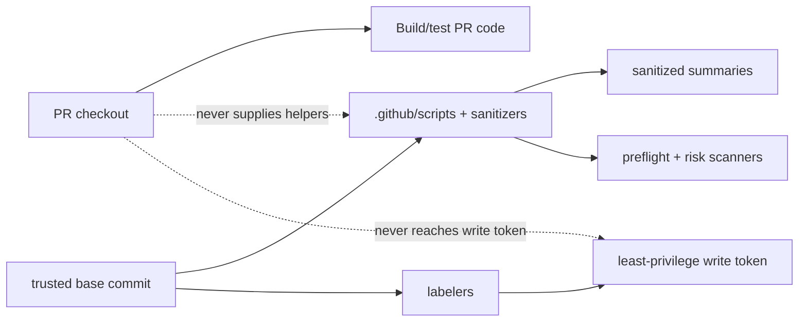

# Workflow Security Trust Boundaries

Maintainer quick reference for workflow, script, sanitizer, cache, artifact,
release, labeler, or PR automation changes.

## Visual Model



## Rules

| Area | Rule |
|------|------|
| PR code | Build/test with read-only credentials and `persist-credentials: false`. |
| Helpers | Source `.github/scripts` and sanitizers from `${{ github.event.pull_request.base.sha || github.sha }}`, not the PR checkout. |
| Privileged automation | `pull_request_target`, releases, package pruning, and labelers must not execute PR-head content before mutation. |
| Exceptions | Mark reviewed exceptions with `preflight: allow-* reason=<short-reason>` so maintainers see them in logs and summaries. |

## Clean Preflight Sentinels

```text
workflow files: 20
cache publish canaries: 0
artifact intake canaries: 0
artifact publish canaries: 0
untrusted PR artifact canaries: 0
auth/accounting canaries: 0
PR-controlled script execution canaries: 0
GitHub token format canaries: 0
CodeQL Actions findings: 0
CodeQL Python findings: 0
failures: 0
```

Reviewed exceptions should appear as:

```text
[OK] ... reviewed ... exception reason=<short-reason>
```

## Commands

```bash
PREFLIGHT_BASE_REF=origin/master .github/scripts/preflight-safety-checks.sh --require-tools
gh workflow run ci-preflight-safety.yml --ref <branch>
gh workflow run ci-pr-risk-security-analysis.yml --ref <branch> \
  -f analysis_target='Current branch workflows'
```
